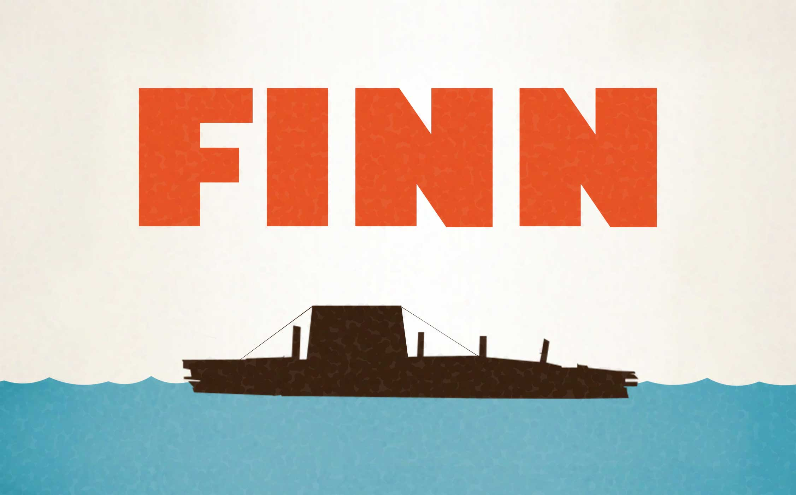

 

Finn is a fast and simple framework for building [Raft](https://ramcloud.stanford.edu/wiki/download/attachments/11370504/raft.pdf) implementations in Go. It uses [Redcon](https://github.com/tidwall/redcon) for the network transport and [Hashicorp Raft](https://github.com/hashicorp/raft) for the state machine. There is also the option to use [FastLog](https://github.com/tidwall/raft-fastlog) or [BoltDB](https://github.com/boltdb/bolt) for log persistence.

